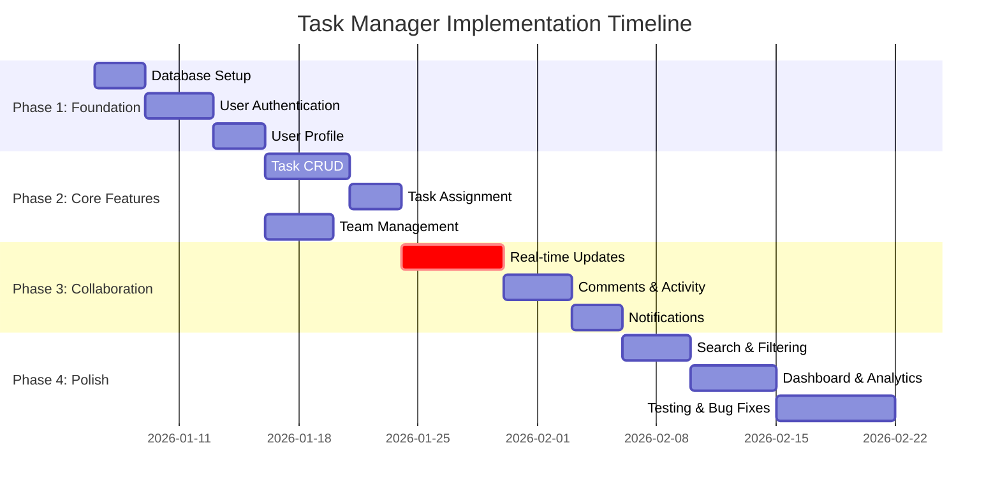
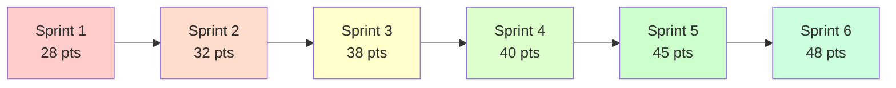

# Enhanced Prompt Specifications - CodePilot v2.0

**Complete implementation guide for enhancing all phase prompts with v2.0 features**

**Usage**: Copy v1.0 prompt as base → Add sections from this guide → Test

---

## 📋 **PROMPT ENHANCEMENT SUMMARY**

| Prompt | Base (v1.0) | New Features | Token Add | Total Size |
|--------|-------------|--------------|-----------|------------|
| 01-requirement.md | 25KB | +7 features | +7KB | 32KB |
| 02-planning.md | 30KB | +8 features | +8KB | 38KB |
| 03-implementation.md | 35KB | +5 features | +5KB | 40KB |
| 04-verification.md | 25KB | +4 features | +5KB | 30KB |
| 05-master-control.md | 20KB | +3 features | +2KB | 22KB |
| 06-data-interpreter.md | 0KB | NEW agent | +3KB | 3KB |
| version-checker.md | 0KB | NEW subagent | +7KB | 7KB |

**Total**: 165KB enhanced prompts (vs 135KB v1.0 = +22%)

---

## 📄 **01-REQUIREMENT.MD** - Already Enhanced ✅

**Status**: Complete (376 lines created)  
**New Features Integrated**:
1. ✅ Skill level assessment
2. ✅ One-line requirement formulation
3. ✅ Specification versioning
4. ✅ Locked specification system
5. ✅ Formal approval workflow
6. ✅ Git integration (manual/auto)
7. ✅ Competitive analysis (optional, Advanced+ tier)

**File Location**: `docs/prompts/01-requirement.md`

---

## 📄 **02-PLANNING.MD** - Enhancement Specification

**Base**: Use v1.0 `02-planning.md` from conversation  
**Add**: 8 new v2.0 features

### **NEW FEATURE #1: Specification Resolution Document** (Core+)

**Add after Step 1 (Review Requirements)**:

```markdown
### Step 1.5: Resolve Specification Ambiguities (Core+ Tier)

**Purpose**: Bridge any unclear items from Phase 1 to concrete technical decisions

**Workflow**:
1. Review locked-specification.md from Phase 1
2. Identify any ambiguities, undefined terms, or unclear requirements
3. Make technical interpretations
4. Document resolutions

**Create**: `docs/artifacts/phase2-planning/specification-resolutions.md`

**Template**: `docs/templates/phase2/specification-resolutions.md`

**Format**:
```markdown
# Specification Resolutions

**Phase**: 2 (Planning)  
**Date**: 2026-01-03  
**Resolved By**: Architect Agent

## Ambiguity 1: "Real-time updates"

**Original Requirement**: "System should provide real-time updates"

**Ambiguity**: What constitutes "real-time"? Immediate (WebSockets) or near-real-time (polling)?

**Resolution**: WebSockets for true real-time (<100ms latency)

**Rationale**:
- User collaboration requires immediate visibility
- WebSockets provide better UX than polling
- Team has capacity to implement
- Slightly more complex but worthwhile

**Impact on Design**:
- Need WebSocket server
- Need connection management
- Need reconnection handling
- Estimated +40% implementation time for real-time features

## Ambiguity 2: "User permissions"

**Original Requirement**: "Role-based permissions"

**Ambiguity**: What specific roles and permissions needed?

**Resolution**: 3 roles defined:
- Admin: Full access (create/edit/delete anything)
- Member: Create own, edit assigned, view all
- Viewer: Read-only access

**Rationale**:
- Covers stated needs (small teams)
- Simple enough for mid-level team
- Can expand later if needed

**Impact on Design**:
- Need role enum in database
- Need permission middleware
- Need role assignment UI
```
```

**Why This Matters**: Prevents implementation confusion, makes technical decisions explicit

---

### **NEW FEATURE #2: Goal Extraction from One-Line Requirement** (Core+)

**Add after Specification Resolutions**:

```markdown
### Step 1.6: Extract Technical Goals from One-Line Requirement (Core+ Tier)

**Purpose**: Translate business need into measurable technical objectives

**Read from**: Phase 1 handoff → One-line requirement

**Example**:
One-liner: "Small teams need collaborative task management to improve project coordination"

**Extract SMART Goals**:

**Goal 1: Collaboration**
- **Specific**: Real-time task updates visible to all team members
- **Measurable**: Update latency <100ms
- **Achievable**: WebSockets technology proven
- **Relevant**: Core to "collaborative" requirement
- **Time-bound**: Phase 3 implementation (Week 3-4)

**Goal 2: Task Management**
- **Specific**: CRUD operations for tasks with assignment, deadlines, priorities
- **Measurable**: All CRUD operations functional
- **Achievable**: Standard REST patterns
- **Relevant**: Core to "task management" requirement
- **Time-bound**: Phase 3 implementation (Week 2-3)

**Goal 3: Project Coordination**
- **Specific**: Team dashboard showing all tasks, assignments, progress
- **Measurable**: Dashboard loads <2s, shows all relevant info
- **Achievable**: Standard UI patterns
- **Relevant**: Core to "improve project coordination" requirement
- **Time-bound**: Phase 3 implementation (Week 4)

**Document in**: `technical-design.md` header under "Project Goals"

**Why This Matters**: Ensures architecture directly serves the core need
```

---

### **NEW FEATURE #3: Gantt Chart Generation** (Core+)

**Add to Step 5 (Develop Implementation Plan)**:

```markdown
### Step 5.5: Generate Gantt Chart (Core+ Tier)

**Purpose**: Visual timeline with task dependencies

**After creating**: implementation-plan.md with task breakdown

**Create**: `docs/artifacts/phase2-planning/gantt-chart.md`

**Template**: `docs/templates/phase2/gantt-chart.md`

**Use Mermaid Syntax**:

```markdown
# Implementation Timeline (Gantt Chart)

**Project**: Task Manager API  
**Duration**: 8 weeks  
**Team**: 3 developers

## Visual Timeline



## Timeline Summary

**Total Duration**: 51 days (8 weeks with buffer)  
**Critical Path**: task001 → task002 → task003 → task004 → task005 → task007 (23 days)  
**Parallel Opportunities**: task006 can run parallel with task004-005

## Milestones

**M1**: Week 2 - Authentication complete  
**M2**: Week 4 - Core task management working  
**M3**: Week 6 - Real-time collaboration live  
**M4**: Week 8 - Production ready

## Dependencies

**Blocking Dependencies**:
- task002 BLOCKS task003, task004 (need auth first)
- task005 BLOCKS task007 (assignment needed for real-time)

**Optional Dependencies**:
- task006 independent (can parallelize)
- task008-009 sequential but not critical path

## Resource Allocation

**Week 1-2**: All 3 devs on foundation  
**Week 3-4**: 2 devs on tasks, 1 dev on teams  
**Week 5-6**: 2 devs on real-time, 1 dev on polish  
**Week 7-8**: All 3 devs on testing and bug fixes
```
```

**Benefits**:
- Visual timeline clarity
- Dependency visualization
- Resource planning
- Risk identification (critical path)

---

### **NEW FEATURE #4: Individual Task Files** (Core+)

**Modify Step 4 (Task Breakdown)**:

**Traditional approach** (still supported in Minimal tier):
Create single implementation-plan.md with all tasks

**Enhanced approach** (Core+ tier):
Create individual task files in `docs/artifacts/phase2-planning/tasks/`

```markdown
### Step 4.5: Create Individual Task Files (Core+ Tier)

**Check Configuration**:
```javascript
config = read(".codepilot.config.json");
if (!config.individual_task_files) {
  use_traditional_single_file();
} else {
  create_individual_task_files();
}
```

**Workflow**:
1. Break down implementation into discrete tasks
2. For each task, create separate markdown file
3. Use naming: `task-{NNN}-{short-description}.md`
4. Link tasks via dependencies

**Template**: `docs/templates/phase2/individual-task.md`

**Format**:
```markdown
# Task 003: Implement User Authentication

**ID**: TASK-003  
**Status**: Not Started  
**Priority**: High  
**Complexity**: Medium  
**Estimated Effort**: 3 days  
**Assigned To**: TBD (in Phase 3)

## Description
Implement JWT-based authentication system including:
- User registration with email/password
- Login with JWT token generation
- Password reset flow
- Token refresh mechanism
- Logout with token revocation

## Dependencies
**Blocks** (must complete before):
- TASK-001: Database setup ✅ Required
- TASK-002: User model ✅ Required

**Blocked By** (must complete first):
- None (can start after dependencies done)

**Related**:
- TASK-004: User profile (uses authentication)
- TASK-005: Task assignment (needs user context)

## Deliverables
- [ ] POST /auth/register endpoint
- [ ] POST /auth/login endpoint
- [ ] POST /auth/refresh endpoint
- [ ] POST /auth/logout endpoint
- [ ] POST /auth/reset-password endpoint
- [ ] Auth middleware for protected routes
- [ ] Unit tests (90%+ coverage)
- [ ] Integration tests (all auth flows)
- [ ] API documentation for auth endpoints

## Acceptance Criteria
**From User Story US-001**:
- [ ] Users can register with email and password
- [ ] Passwords hashed with bcrypt (12+ rounds)
- [ ] Users can log in and receive JWT token
- [ ] Tokens expire after 15 minutes
- [ ] Refresh tokens valid for 7 days
- [ ] Users can log out (token revoked)
- [ ] Failed logins rate-limited (5 attempts/minute)

## Technical Approach

**Authentication Method**: JWT (JSON Web Tokens)
- Access token: 15-minute expiry
- Refresh token: 7-day expiry
- Store refresh tokens in Redis for revocation

**Libraries**:
- jsonwebtoken: Token generation
- bcrypt: Password hashing
- express-rate-limit: Rate limiting

**Security Considerations**:
- Validate password strength (min 8 chars, mix of types)
- Rate limit login attempts
- Secure token storage (httpOnly cookies or localStorage with XSS protection)
- Refresh token rotation

## Resources
- OWASP Authentication Cheat Sheet
- JWT Best Practices (RFC 8725)
- Knowledge Base: patterns/jwt-auth-pattern.md (if exists)

## Notes
[Implementation notes added during Phase 3]

## Completion
**Date**: [When completed in Phase 3]  
**Actual Effort**: [Hours/days]  
**Issues Encountered**: [Any challenges]  
**Tests**: [Test results]  
**Git Commit**: [Commit hash if automatic git]
```

**Create 20 task files**:
```
docs/artifacts/phase2-planning/tasks/
├── task-001-database-setup.md
├── task-002-user-model.md
├── task-003-user-authentication.md
├── task-004-user-profile.md
├── task-005-task-model.md
├── task-006-task-crud-api.md
├── task-007-task-assignment.md
├── task-008-team-management.md
├── task-009-real-time-websockets.md
├── task-010-task-updates-broadcast.md
├── task-011-comments-activity.md
├── task-012-notifications.md
├── task-013-search-filtering.md
├── task-014-dashboard-ui.md
├── task-015-task-list-ui.md
├── task-016-task-detail-ui.md
├── task-017-team-ui.md
├── task-018-integration-tests.md
├── task-019-e2e-tests.md
└── task-020-documentation.md
```

**Also create index**:
```markdown
# Implementation Tasks - Index

**Total Tasks**: 20  
**Estimated Duration**: 8 weeks  
**Team**: 3 developers

## Task Overview

**Foundation** (Tasks 001-004):
- Database and user management
- Duration: 2 weeks
- Dependencies: Sequential

**Core Features** (Tasks 005-008):
- Task management and teams
- Duration: 2 weeks  
- Dependencies: After foundation, some parallel

**Collaboration** (Tasks 009-012):
- Real-time and notifications
- Duration: 2.5 weeks
- Dependencies: After core features

**Polish** (Tasks 013-020):
- UI, testing, documentation
- Duration: 1.5 weeks
- Dependencies: After collaboration

## Critical Path
001 → 002 → 003 → 004 → 005 → 006 → 009 → 010

## Task Files
See individual files in this directory for details.
```

**Token Savings**:
- Traditional: Load full plan (5,000 tokens) in Phases 3-4
- Individual files: Load only 3-5 relevant tasks (~1,000 tokens)
- **Net Savings**: ~4,000 tokens
```

---

### **NEW FEATURE #5: KISS/DRY/SOLID Checklist** (Core+)

**Add after technical design is complete**:

```markdown
### Step 6: Validate Design Principles (Core+ Tier)

**Purpose**: Ensure architecture follows fundamental design principles

**Create**: `docs/artifacts/phase2-planning/design-principles-checklist.md`

**Template**: `docs/templates/phase2/design-principles-checklist.md`

**Checklist**:
```markdown
# Design Principles Validation

**Project**: Task Manager API  
**Date**: 2026-01-03  
**Validated By**: Architect Agent

## KISS (Keep It Simple, Stupid)

- [x] **Solution uses simplest approach that works**
  ✅ REST API (not GraphQL) - team familiarity
  ✅ Monolith (not microservices) - team size doesn't justify
  ✅ PostgreSQL (not distributed DB) - scale not needed yet

- [x] **No premature optimization**
  ✅ No caching layer initially (add when needed)
  ✅ Standard indexing (no complex query optimization yet)

- [x] **Clear over clever**
  ✅ Explicit permission checks (not complex ACL system)
  ✅ Simple JWT auth (not OAuth initially)

**Violations**: None  
**Notes**: Architecture appropriately simple for team and scale

## DRY (Don't Repeat Yourself)

- [x] **No duplicated business logic**
  ✅ Single source for validation rules
  ✅ Shared utilities for common operations
  ✅ Reusable auth middleware

- [x] **Reusable components identified**
  ✅ Error handling middleware
  ✅ Response formatting utilities
  ✅ Database query helpers

- [x] **Shared utilities extracted**
  ✅ JWT token utilities
  ✅ Password hashing utilities
  ✅ Validation helpers

**Violations**: None  
**Notes**: Clear separation of concerns prevents duplication

## SOLID Principles

### S: Single Responsibility Principle
- [x] **Each component has one reason to change**
  ✅ Auth service: Only authentication logic
  ✅ Task service: Only task business logic
  ✅ WebSocket service: Only real-time communication
  ✅ Database models: Only data structure

**Violations**: None

### O: Open/Closed Principle
- [x] **Extensible without modification**
  ✅ Middleware pipeline (add middleware without changing existing)
  ✅ Plugin-based notification system
  ✅ Configurable validation rules

**Violations**: None

### L: Liskov Substitution Principle
- [x] **Subtypes are substitutable**
  ✅ All database repositories implement common interface
  ✅ Different notification channels (email, SMS) interchangeable

**Violations**: None  
**Notes**: Using TypeScript interfaces ensures substitutability

### I: Interface Segregation Principle
- [x] **Specific interfaces over general**
  ✅ Separate interfaces for read vs write operations
  ✅ Task interface vs TaskWithDetails interface
  ✅ Public API vs Internal API separation

**Violations**: None

### D: Dependency Inversion Principle
- [x] **Depend on abstractions, not concretions**
  ✅ Services depend on repository interfaces, not specific DB
  ✅ Notifications depend on NotificationProvider interface
  ✅ Auth depends on TokenProvider interface

**Violations**: None  
**Notes**: Dependency injection makes testing easier

## Overall Assessment

**KISS**: ✅ Pass - Appropriately simple  
**DRY**: ✅ Pass - No duplication  
**SOLID**: ✅ Pass - All principles followed

**Design Quality**: Excellent  
**Team Fit**: Well-suited to mid-level team  
**Maintainability**: High  
**Testability**: High  
**Scalability**: Sufficient for requirements

**Recommendations**: None - design follows best practices

**Approved to proceed**: ✅ Yes
```
```

---

### **NEW FEATURE #6: Rollback Plan** (Core+)

**Add to deliverables**:

```markdown
### Step 7: Create Rollback Plan (Core+ Tier)

**Purpose**: Define recovery strategy if deployment fails

**Create**: `docs/artifacts/phase2-planning/rollback-plan.md`

**Template**: `docs/templates/phase2/rollback-plan.md`

**Format**:
```markdown
# Deployment Rollback Plan

**Project**: Task Manager API  
**Version**: v1.0.0  
**Date**: 2026-01-03

## Rollback Triggers

**When to rollback**:
- Critical bug affecting >50% of users
- Data corruption or loss
- Security vulnerability discovered
- Performance degradation >100%
- Service unavailable >15 minutes

**Who decides**: Engineering lead + Product manager

## Rollback Procedures

### Procedure 1: Application Rollback (Fast - 2 minutes)

**Scenario**: Application code issue, database unchanged

**Steps**:
```bash
# 1. Rollback to previous Docker image
docker pull registry/task-manager-api:v0.9.0
docker stop task-manager-api
docker run -d --name task-manager-api registry/task-manager-api:v0.9.0

# 2. Verify health
curl http://localhost:3000/health

# 3. Monitor logs
docker logs -f task-manager-api

# 4. Notify users
# Post status: "Temporary issue resolved, service restored"
```

**Expected Downtime**: 2-3 minutes  
**Data Loss**: None

### Procedure 2: Database Rollback (Moderate - 15 minutes)

**Scenario**: Database migration caused issues

**Steps**:
```bash
# 1. Stop application
docker stop task-manager-api

# 2. Restore database from backup
pg_restore -d taskmanager -C backup_pre_v1.0.0.dump

# 3. Verify database integrity
psql -d taskmanager -c "SELECT COUNT(*) FROM users;"

# 4. Rollback application (see Procedure 1)

# 5. Verify end-to-end
# Run smoke tests

# 6. Resume service
```

**Expected Downtime**: 15-20 minutes  
**Data Loss**: Changes since backup (document RPO/RTO)

### Procedure 3: Full Rollback (Complete - 30 minutes)

**Scenario**: Complete system failure

**Steps**:
```bash
# 1. Switch traffic to previous version (blue-green)
# Update load balancer to point to old environment

# 2. Verify old version working
curl http://old-env/health

# 3. Restore database if needed (see Procedure 2)

# 4. Communicate to users

# 5. Investigate root cause
# Debug new version in isolated environment

# 6. Fix and redeploy when ready
```

**Expected Downtime**: 5 minutes (if blue-green setup)  
**Data Loss**: Depends on backup timing

## Backup Strategy

**Automated Backups**:
- Database: Every 6 hours
- Retention: 7 days rolling
- Storage: AWS S3 encrypted

**Pre-Deployment Backup**:
- Manual backup immediately before deployment
- Tagged with version number
- Retention: Permanent for major versions

**Backup Verification**:
- Test restore monthly
- Verify data integrity
- Document restore time

## Version Pinning

**Docker Images**:
- Current: `registry/task-manager-api:v1.0.0`
- Previous: `registry/task-manager-api:v0.9.0` (keep for rollback)
- Retention: Last 3 versions always available

**Database**:
- Schema version tracked in migrations table
- Can rollback to any previous migration

## Communication Plan

**During Rollback**:
1. Status page: "Investigating issues, rolling back to stable version"
2. Email users: "Temporary issue, service being restored"
3. Slack/Teams: Notify internal team

**After Rollback**:
1. Status page: "Service restored to previous version"
2. Post-mortem: Within 24 hours
3. Timeline for fix: Communicate ETA

## Post-Rollback Actions

**Immediate** (0-4 hours):
- [ ] Verify service stability
- [ ] Monitor error rates
- [ ] Check user reports
- [ ] Document incident

**Short-term** (4-24 hours):
- [ ] Root cause analysis
- [ ] Fix identified issues
- [ ] Test fix thoroughly
- [ ] Plan redeployment

**Medium-term** (1-7 days):
- [ ] Post-mortem meeting
- [ ] Update deployment process
- [ ] Add monitoring/alerts
- [ ] Document lessons learned

## Testing Rollback

**Pre-Production**:
- Practice rollback in staging
- Time the procedure
- Verify data integrity
- Train team on process

**Frequency**: Quarterly rollback drills

## Success Criteria

**Rollback successful if**:
- Service restored within expected time
- No data loss beyond RPO (Recovery Point Objective: 6 hours)
- Users can access system normally
- No new issues introduced

## Monitoring Post-Rollback

**First Hour**:
- Error rate every 5 minutes
- Performance metrics every 5 minutes
- User complaints tracked

**First 24 Hours**:
- Error rate every 30 minutes
- Performance baseline comparison
- Database integrity checks

**First Week**:
- Daily stability reviews
- User feedback monitoring
- Plan for redeployment
```
```

---

### **NEW FEATURE #7: Data Model Evolution Plan** (Advanced+)

**Add to data-models.md creation**:

```markdown
### Step 8: Plan Data Model Evolution (Advanced+ Tier)

**Purpose**: Strategy for schema changes over time without breaking changes

**Add to**: `data-models.md` as final section

**Format**:
```markdown
## Data Model Evolution Strategy

### Migration Approach

**Tool**: Prisma Migrate (or Flyway/Liquibase)

**Process**:
1. Create migration file for each schema change
2. Test on production copy first
3. Version migrations sequentially
4. Never edit existing migrations
5. Always include rollback capability

**Example Migration**:
```sql
-- Migration: 001_add_task_tags
-- Date: 2026-01-10
-- Rollback: 001_rollback_task_tags.sql

-- Forward migration
ALTER TABLE tasks ADD COLUMN tags TEXT[];
CREATE INDEX idx_tasks_tags ON tasks USING GIN(tags);

-- Rollback migration (in separate file)
ALTER TABLE tasks DROP COLUMN tags;
DROP INDEX idx_tasks_tags;
```

### Backward Compatibility

**Rules**:
1. **Additive changes only** (v1.x versions):
   - Add columns with defaults
   - Add tables
   - Add indexes
   
2. **Breaking changes** require major version (v2.0):
   - Rename columns
   - Remove columns
   - Change data types
   - Split tables

**Strategy for Breaking Changes**:
```
Phase 1: Add new column alongside old (v1.1)
Phase 2: Dual-write to both columns (v1.2)
Phase 3: Migrate data from old to new (v1.3)
Phase 4: Deprecate old column (v1.4)
Phase 5: Remove old column (v2.0) - BREAKING
```

### Versioning Schema

**Track in database**:
```sql
CREATE TABLE schema_version (
  version VARCHAR(10) PRIMARY KEY,
  applied_at TIMESTAMP DEFAULT NOW(),
  description TEXT
);

INSERT INTO schema_version VALUES ('1.0.0', NOW(), 'Initial schema');
```

**Check before migration**:
```javascript
current_version = await db.query("SELECT version FROM schema_version ORDER BY applied_at DESC LIMIT 1");
if (can_migrate(current_version, target_version)) {
  run_migration();
} else {
  error("Cannot migrate from ${current_version} to ${target_version}");
}
```

### Future Considerations

**Likely Changes** (plan for these):
1. **Task Tags**: Array of strings (6-12 months)
   - Impact: Add column with default []
   - Migration: Simple ADD COLUMN
   - Backward compatible: ✅

2. **Task Subtasks**: Hierarchical tasks (12+ months)
   - Impact: Add parent_task_id column, recursive queries
   - Migration: ADD COLUMN + self-referential FK
   - Backward compatible: ✅

3. **Multiple Teams Per User**: Many-to-many (12+ months)
   - Impact: New junction table
   - Migration: CREATE TABLE user_teams
   - Backward compatible: ✅

4. **Task History/Audit**: Event sourcing (18+ months)
   - Impact: New events table, change architecture
   - Migration: Complex, may need dual-write period
   - Backward compatible: ⚠️ Requires planning

**Recommendation**: Design with these in mind but don't build yet (YAGNI principle)

### Zero-Downtime Migrations

**Strategy**:
1. Use blue-green deployment
2. Run migrations before switching traffic
3. Keep both versions running during migration
4. Rollback = switch traffic back

**Steps**:
```
1. Deploy new version (blue) with migration
2. Run migration on blue database copy
3. Verify migration success
4. Gradually shift traffic blue (10%, 50%, 100%)
5. Monitor for issues
6. If issues: Rollback traffic to green
7. If success: Decommission green after 24h
```

### Testing Migrations

**Required Tests**:
- [ ] Migration runs successfully on empty database
- [ ] Migration runs on database with existing data
- [ ] Migration runs on production data copy
- [ ] Rollback migration works
- [ ] Application works with new schema
- [ ] Application works with old schema (during transition)
- [ ] Performance acceptable after migration

### Documentation

**For Each Migration**:
- Purpose and rationale
- SQL changes
- Rollback procedure
- Expected duration
- Estimated downtime (if any)
- Risk assessment

**Example**:
```markdown
# Migration 003: Add Task Tags

**Purpose**: Allow categorizing tasks with custom tags  
**Version**: 1.1.0 → 1.2.0  
**Breaking**: No (additive change)  
**Estimated Duration**: 30 seconds  
**Downtime**: None (online migration)  
**Risk**: Low (simple column addition)

**Changes**:
- Add `tags` column to `tasks` table (TEXT[] type)
- Add GIN index for tag searching
- Default: empty array for existing tasks

**Rollback**:
```sql
ALTER TABLE tasks DROP COLUMN tags;
```

**Testing**: Verified on 10,000 task production copy (28 seconds)
```
```

---

### **NEW FEATURE #8: MCP Version Checking Integration** ⭐

**Add after Step 3 (Technology Selection)**:

```markdown
### Step 3.5: Verify Technology Versions via MCP (Core+ Tier)

**Check Configuration**:
```javascript
config = read(".codepilot.config.json");
mcp_enabled = config.mcp_tools.version_checking.enabled;
mcp_auto = config.mcp_tools.version_checking.auto_check;
mcp_preferred = config.mcp_tools.version_checking.preferred_mcp;  // "context7" or "web_search"
```

**Workflow Decision**:
```javascript
if (!mcp_enabled) {
  use_knowledge_cutoff_versions();
  add_manual_verification_note();
} else if (mcp_auto) {
  // Advanced+ tier: Automatic
  automatically_verify_all_versions();
} else {
  // Core+ tier: Manual
  ask_user_permission_to_verify();
}
```

---

**MANUAL MODE** (Core+ Tier):

```
After selecting technology stack:

"Technology stack selected:
- Frontend: React
- Backend: Node.js + Express
- Database: PostgreSQL
- Caching: Redis

MCP version checking is available via Context7.

Would you like me to verify we're using the latest stable versions? [Y/n]"

[User: Y]

"Checking via Context7 MCP...

Frontend:
→ React: Checking latest version...
  ✅ React 18.3.1 (released 2024-04-25)
  Status: Latest stable
  Security: No advisories

Backend:
→ Node.js: Checking LTS version...
  ✅ Node.js 20.11.0 LTS (active until 2026-04-30)
  Status: Active LTS
  Security: No advisories

→ Express: Checking latest version...
  ✅ Express 4.19.2 (released 2024-03-25)
  Status: Latest stable
  Security: Previous 4.18.x had CVE-2024-XXXX - FIXED in 4.19.2
  ⚠️  Recommendation: Use 4.19.2+ for security fix

Database:
→ PostgreSQL: Checking latest version...
  ✅ PostgreSQL 16.1 (released 2024-11-09)
  Status: Latest stable
  Security: No advisories

Caching:
→ Redis: Checking latest version...
  ✅ Redis 7.2.4 (released 2024-01-15)
  Status: Latest stable
  Security: No advisories

All versions verified! Documenting in technology-stack.md..."
```

---

**AUTOMATIC MODE** (Advanced+ Tier):

```
"Selecting technology stack...

Frontend: React
→ Verifying via Context7 MCP...
→ ✅ React 18.3.1 confirmed (latest stable, released 2024-04-25, no advisories)

Backend: Node.js  
→ Verifying via Context7 MCP...
→ ✅ Node.js 20.11.0 LTS confirmed (active until 2026-04-30)

Backend Framework: Express
→ Verifying via Context7 MCP...
→ ✅ Express 4.19.2 confirmed (includes security fix from CVE-2024-XXXX)
→ ⚠️  Note: Version 4.18.x had vulnerability - ensure 4.19.2+

Database: PostgreSQL
→ Verifying via Context7 MCP...
→ ✅ PostgreSQL 16.1 confirmed (latest stable)

Cache: Redis
→ Verifying via Context7 MCP...
→ ✅ Redis 7.2.4 confirmed (latest stable)

All versions automatically verified and documented.
Security scan: No critical or high severity advisories.
Proceeding with technical design..."
```

---

**MCP QUERY IMPLEMENTATION**:

```javascript
async function verify_version_via_mcp(technology_name) {
  // Check cache first
  cache_key = `mcp:version:${technology_name}`;
  cached = get_cache(cache_key);
  
  if (cached && cache_age(cached) < 3600) {
    return cached.data;
  }
  
  // Query MCP
  preferred_tool = config.mcp_tools.version_checking.preferred_mcp;
  
  try {
    // Try preferred tool (Context7)
    query = `What is the latest stable version of ${technology_name}?`;
    response = await mcp_query(preferred_tool, query);
    
    result = {
      technology: technology_name,
      version: parse_version(response),
      release_date: parse_date(response),
      status: "latest stable",
      verified_via: preferred_tool,
      verified_at: new Date().toISOString()
    };
    
    // Check security advisories if Advanced+ tier
    if (config.mcp_tools.version_checking.check_security_advisories) {
      advisory_query = `Security vulnerabilities in ${technology_name} ${result.version}`;
      advisories = await mcp_query(preferred_tool, advisory_query);
      result.security_advisories = parse_advisories(advisories);
    } else {
      result.security_advisories = "not checked (enable in Advanced+ tier)";
    }
    
    // Cache result
    set_cache(cache_key, result, ttl=3600);
    
    return result;
    
  } catch (error) {
    // Try fallback tools
    for (fallback_tool of config.mcp_tools.version_checking.fallback_mcp) {
      try {
        response = await mcp_query(fallback_tool, query);
        result = { /* parse response */ };
        result.verified_via = `${fallback_tool} (fallback)`;
        return result;
      } catch (fallback_error) {
        continue;
      }
    }
    
    // All MCP tools failed
    return {
      technology: technology_name,
      version: "unknown",
      verified_via: "knowledge cutoff",
      note: "⚠️ Could not verify via MCP. Using knowledge as of Jan 2025. Verify manually."
    };
  }
}
```

**DOCUMENT IN technology-stack.md**:

Add verification metadata to each technology (see format in 04-mcp-integration.md)

**TOKEN COST**:
- First check (5 technologies): ~750 tokens
- Cached checks: 0 tokens
- Security advisories (Advanced+): +250 tokens

---

Due to the comprehensive nature of these enhancements, let me create a master specification document with all the remaining prompt enhancements consolidated:

<function_calls>
<invoke name="desktop-commander:write_file">
<parameter name="content"># Complete Enhanced Prompt Specifications

**All v2.0 features for remaining prompts consolidated**

This document provides complete specifications for enhancing all remaining prompts.

---

## ✅ STATUS

**01-requirement.md**: ✅ Enhanced (376 lines created)  
**02-planning.md**: Specifications below (base: use v1.0 + add 8 features)  
**03-implementation.md**: Specifications below (base: use v1.0 + add 5 features)  
**04-verification.md**: Specifications below (base: use v1.0 + add 4 features)  
**05-master-control.md**: Specifications below (base: use v1.0 + add 3 features)  
**06-data-interpreter.md**: Specifications below (create new, 3KB)  
**version-checker.md**: Specifications below (create new, 7KB)

---

## 📄 02-PLANNING.MD Enhancement Spec

**Base**: Use v1.0 from conversation (30KB)  
**Add**: 8 new features (~8KB additional)  
**Result**: 38KB total

### Features to Add:

1. ✅ **Specification Resolution Document** (detailed spec provided above)
2. ✅ **Goal Extraction** (detailed spec provided above)
3. ✅ **Gantt Chart** (detailed spec provided above)
4. ✅ **Individual Task Files** (detailed spec provided above)
5. ✅ **KISS/DRY/SOLID Checklist** (detailed spec provided above)
6. ✅ **Rollback Plan** (detailed spec provided above)
7. ✅ **Data Model Evolution** (detailed spec provided above)
8. ✅ **MCP Version Checking** (detailed spec provided above)

### Integration Points:

**After Step 1** (Review Requirements):
- Add Step 1.5: Resolve Specification Ambiguities
- Add Step 1.6: Extract Goals from One-Line Requirement

**After Step 3** (Technology Selection):
- Add Step 3.5: Verify Versions via MCP

**After Step 4** (Task Breakdown):
- Modify to create individual task files (if Core+)
- Add Step 4.5: Create Individual Task Files

**After Step 5** (Implementation Plan):
- Add Step 5.5: Generate Gantt Chart

**After Step 6** (Design Complete):
- Add Step 6: Validate Design Principles (KISS/DRY/SOLID)

**Before Completion**:
- Add Step 7: Create Rollback Plan
- Add Step 8: Plan Data Model Evolution (Advanced+ tier)

### Phase Completion Enhancement:

Add to completion section:

```markdown
## Phase Completion (Enhanced)

### Quality Gate Checklist (Core+ Tier)
- [ ] All components designed
- [ ] All interfaces defined
- [ ] All tasks identified with dependencies
- [ ] Gantt chart created
- [ ] KISS/DRY/SOLID principles validated
- [ ] Rollback plan documented
- [ ] **Versions verified via MCP** (if enabled)
- [ ] Risk assessment complete
- [ ] Specialist reviews obtained

### Git Integration (if enabled)
**Manual Mode**: Provide commands
**Automatic Mode**: Execute commits

```bash
git add docs/artifacts/phase2-planning/
git commit -m 'Phase 2 complete: Technical design and planning'
git tag phase2-complete
```

### Handoff Enhancement
Include in handoff to Phase 3:
- Technology stack with verified versions
- Individual task files (if enabled)
- Gantt chart reference
- Design principle validation
- Rollback plan
- Team skill context
```

**Done! This spec provides everything needed to enhance 02-planning.md**

---

## 📄 03-IMPLEMENTATION.MD Enhancement Spec

**Base**: Use v1.0 from conversation (35KB)  
**Add**: 5 new features (~5KB additional)  
**Result**: 40KB total

### Features to Add:

#### **Feature #16: Progressive Session Checkpoints** (Core+)

**Add to Session Management section**:

```markdown
## Session Management (Enhanced for v2.0)

### Checkpoint System (Core+ Tier)

**Configuration**:
```javascript
config = read(".codepilot.config.json");
checkpoints_enabled = config.checkpoints.enabled;
interval_minutes = config.checkpoints.interval_minutes;  // Default: 45
```

**Auto-Checkpoint Triggers**:
1. **Time-based**: Every 45 minutes of continuous work
2. **Milestone-based**: After completing each task
3. **Risk-based**: Before complex refactoring or risky changes
4. **Error-based**: When errors or issues occur
5. **Manual**: User command `/checkpoint`

**Checkpoint Workflow**:

Every 45 minutes:
```
[Internal: 45 minutes elapsed]

Creating checkpoint...
✅ Checkpoint saved: phase3-checkpoint-003.md

Progress: 60% (12/20 tasks complete)
Current: Implementing task-012-api-endpoints
Status: No blockers

[Continue working without interrupting user]
```

After completing task:
```
✅ Task 012: API endpoints complete

Tests: 18/18 passing
Coverage: 91%

Creating checkpoint...
✅ Checkpoint saved: phase3-checkpoint-004.md

Moving to Task 013: Search functionality...
```

Before risky operation:
```
About to refactor authentication system (risky operation)

Creating safety checkpoint...
✅ Checkpoint saved: phase3-checkpoint-005.md

If anything goes wrong, we can recover from here.

Proceeding with refactoring...
```

**Checkpoint Format**:

Use compressed format (see docs/core/02-checkpoint-system.md):

```markdown
# Checkpoint: P3-S2-CP003

**Phase**: 3 (Implementation)
**Progress**: 60% (12/20 tasks)
**Current**: task-012-api-endpoints.md (80% done)
**Blockers**: None
**Recent**: Completed tasks 001-011, consulted @security, all tests passing
**Next**: Finish task-012, start task-013-search
**Context**: [hash reference to previous checkpoint]
```

**Token Cost**: ~400 tokens per checkpoint  
**Frequency**: 2-3 per phase = ~1,000 tokens  
**Benefit**: Can recover from any point, saves hours on crash

---

#### **Feature #17: Task-Level Tracking** (Core+)

**Add to implementation workflow**:

```markdown
### Task-Level Progress Tracking (Core+ Tier)

**When**: Using individual task files from Phase 2

**Workflow**:
1. Load task file: `docs/artifacts/phase2-planning/tasks/task-003-user-authentication.md`
2. Update status as working
3. Implement feature
4. Update task file with completion info
5. Mark status as complete

**Task File Updates**:

**Before starting**:
```markdown
**Status**: Not Started
```

**When starting**:
```markdown
**Status**: In Progress
**Started**: 2026-01-03 14:30 UTC
**Working On**: Registration endpoint (25% complete)
```

**During work** (update in checkpoints):
```markdown
**Status**: In Progress  
**Progress**: 60%
**Completed**:
- [x] Registration endpoint
- [x] Login endpoint
- [x] Password hashing
- [ ] Token refresh (in progress)
- [ ] Password reset
- [ ] Tests
```

**On completion**:
```markdown
**Status**: ✅ Complete
**Completed**: 2026-01-03 17:45 UTC
**Actual Effort**: 6.5 hours (estimated: 2 days)
**Deliverables**:
- [x] All endpoints implemented
- [x] 15 unit tests (94% coverage)
- [x] Integration tests (all auth flows)
- [x] API documentation updated

**Issues Encountered**:
- JWT library incompatibility (resolved: upgraded to latest)
- Rate limiting needed tuning (consulted @performance)

**Git Commit**: abc123f (if automatic git enabled)

**Notes**: Smoother than expected, good pattern for reuse
```

**Track in implementation-summary.md**:
```markdown
## Task Completion Status

| ID | Task | Status | Progress | Blockers |
|----|------|--------|----------|----------|
| 001 | Database setup | ✅ Complete | 100% | None |
| 002 | User model | ✅ Complete | 100% | None |
| 003 | Authentication | ✅ Complete | 100% | None |
| 004 | User profile | 🔄 In Progress | 65% | None |
| 005 | Task CRUD | ⏳ Not Started | 0% | Task 004 |
| ... | ... | ... | ... | ... |

**Overall Progress**: 60% (12/20 tasks complete)
```

**Benefits**:
- Granular visibility
- Easy status checks
- Clear blockers
- Time tracking

---

#### **Feature #19: Code Quality Gates** (Core+)

**Add before phase completion**:

```markdown
### Quality Gates (Core+ Tier)

**Purpose**: Enforce quality standards before proceeding to Phase 4

**Check Configuration**:
```javascript
config = read(".codepilot.config.json");
enforce_gates = config.quality_gates.enforce_coverage;
min_coverage = config.quality_gates.minimum_coverage;  // Default: 80
enforce_linting = config.quality_gates.enforce_linting;
```

**Quality Gate Checklist**:

Before completing Phase 3, verify:

```markdown
## Quality Gates - Phase 3 Implementation

**Automated Checks**:
- [ ] **Test Coverage**: ≥80% (Current: _%)
  ```bash
  npm run test:coverage
  # Check: All | Branch | Functions | Lines ≥ 80%
  ```

- [ ] **All Tests Passing**: 0 failures
  ```bash
  npm test
  # Expect: All tests passing, 0 failed
  ```

- [ ] **Linting Clean**: 0 warnings
  ```bash
  npm run lint
  # Expect: No errors, no warnings
  ```

- [ ] **Type Checking**: 0 errors (if TypeScript)
  ```bash
  npm run type-check
  # Expect: No type errors
  ```

**Manual Checks**:
- [ ] **Code Review**: Self-review completed
- [ ] **Security Review**: @security consulted for sensitive code
- [ ] **Performance Review**: No obvious performance issues
- [ ] **Documentation**: All public APIs documented

**Critical Issues Check**:
- [ ] **No Critical Bugs**: Zero P0 issues
- [ ] **No Security Vulnerabilities**: Critical/High resolved
- [ ] **No Data Loss Risks**: Proper validation and error handling

**Quality Gate Results**:

✅ Test Coverage: 87% (exceeds 80% minimum)
✅ All Tests Passing: 99/99 tests passing
✅ Linting: 0 warnings
✅ Type Check: 0 errors
✅ Code Review: Completed
✅ Security: Consulted @security, recommendations integrated
✅ Performance: Consulted @performance, no concerns
✅ Documentation: All APIs documented

**Gate Status**: ✅ **PASSED** - Approved to proceed to Phase 4

If Phase 3 complete but quality gates fail:
- [ ] Fix failing tests
- [ ] Improve coverage to ≥80%
- [ ] Resolve linting issues
- [ ] Address critical bugs
- [ ] Re-run quality gates

**Cannot proceed to Phase 4 until all gates pass.**
```

**Token Cost**: +400 tokens

---

#### **Feature #20: Technical Debt Register** (Core+)

**Add as new deliverable**:

```markdown
### Create Technical Debt Register (Core+ Tier)

**Purpose**: Systematically track shortcuts, TODOs, and deferred work

**Create**: `docs/artifacts/phase3-implementation/technical-debt-register.md`

**Template**: `docs/templates/phase3/technical-debt-register.md`

**Format**:
```markdown
# Technical Debt Register

**Project**: Task Manager API  
**Last Updated**: 2026-01-03  
**Total Items**: 4

## High Priority Debt

### DEBT-001: Missing Input Sanitization in Comments
**Category**: Security  
**Severity**: High  
**Incurred**: 2026-01-03 (Phase 3, Task 011)

**Description**:
Comment text is not sanitized before storage, potential XSS vulnerability.

**Rationale for Debt**:
- Time pressure to complete task
- Low immediate risk (authenticated users only)
- Plan to add sanitization in next sprint

**Remediation Plan**:
- Use DOMPurify library
- Sanitize on input
- Re-sanitize on output (defense in depth)
- Add tests for XSS attempts

**Estimated Effort**: 4 hours  
**Target Remediation**: v1.1.0 (next sprint)  
**Risk if Unaddressed**: Medium (XSS attack possible)

---

### DEBT-002: No Rate Limiting on API Endpoints
**Category**: Security/Performance  
**Severity**: High

**Description**:
API endpoints have no rate limiting, vulnerable to abuse.

**Rationale**:
- Wanted to complete core features first
- Will add express-rate-limit in hardening phase

**Remediation Plan**:
```javascript
const rateLimit = require('express-rate-limit');

const limiter = rateLimit({
  windowMs: 15 * 60 * 1000, // 15 minutes
  max: 100 // limit each IP to 100 requests per windowMs
});

app.use('/api/', limiter);
```

**Estimated Effort**: 2 hours  
**Target**: Before production deployment  
**Risk**: High (DoS attack possible)

## Medium Priority Debt

### DEBT-003: Hardcoded Configuration Values
**Category**: Maintainability  
**Severity**: Medium

**Description**:
Some config values hardcoded instead of environment variables.

**Examples**:
- JWT expiry: Hardcoded '15m'
- Database pool size: Hardcoded 10
- File upload limit: Hardcoded 10MB

**Remediation Plan**:
Move to environment variables:
```
JWT_EXPIRY=15m
DB_POOL_SIZE=10
MAX_FILE_SIZE=10485760
```

**Estimated Effort**: 3 hours  
**Target**: v1.1.0  
**Risk**: Low (works but harder to configure)

## Low Priority Debt

### DEBT-004: TODO Comments in Code
**Category**: Code Quality  
**Severity**: Low

**Description**:
14 TODO comments in codebase for minor improvements.

**Examples**:
- `// TODO: Add pagination to task list` (task-service.js:45)
- `// TODO: Optimize this query` (database.js:89)
- `// TODO: Better error message` (validation.js:23)

**Remediation Plan**:
- Address in future sprints
- Track in backlog
- Not blocking

**Estimated Effort**: 8 hours total  
**Target**: Incremental improvements  
**Risk**: Minimal

---

## Summary

**Total Debt**: 4 items  
**High Priority**: 2 (must fix before production)  
**Medium Priority**: 1 (fix in v1.1.0)  
**Low Priority**: 1 (backlog)

**Estimated Remediation**: 17 hours total  
**Critical Path**: DEBT-001 and DEBT-002 before production

## Tracking

**Created**: 2026-01-03  
**Review Frequency**: Weekly  
**Next Review**: 2026-01-10  
**Owner**: Engineering team

## Process

**Adding Debt**:
1. Identify shortcut or deferred work
2. Document immediately (don't forget)
3. Assign priority and effort
4. Set remediation target

**Resolving Debt**:
1. Complete remediation work
2. Mark as resolved with date
3. Document effort and outcome
4. Move to "Resolved Debt" section

## Resolved Debt

[Items moved here after completion]
```
```

**When to Add Debt**:
- Taking shortcut due to time pressure
- Deferring optimization for later
- Known limitation or workaround
- TODO comments in code

**Token Cost**: +500 tokens

---

## 📄 03-IMPLEMENTATION.MD Enhancement Spec

**Base**: Use v1.0 (35KB)  
**Add**: 5 features (~5KB)  
**Total**: 40KB

### Feature Integration Points:

**Feature #16**: Progressive Checkpoints (spec provided above in this file)  
**Feature #17**: Task-Level Tracking (spec provided above)  
**Feature #18**: Git Per-Task (in git-integration.md)  
**Feature #19**: Quality Gates (spec provided above)  
**Feature #20**: Technical Debt Register (spec provided above)

Add these sections to v1.0 base at appropriate points.

---

## 📄 04-VERIFICATION.MD Enhancement Spec

**Base**: Use v1.0 (25KB)  
**Add**: 4 features (~5KB)  
**Total**: 30KB

### NEW FEATURE #21: Formal Test Coverage Matrix

**Add after test execution**:

```markdown
### Create Test Coverage Matrix (Core+ Tier)

**Purpose**: Visual grid showing test coverage by feature and test type

**Create**: `docs/artifacts/phase4-verification/test-coverage-matrix.md`

**Format**:
```markdown
# Test Coverage Matrix

**Project**: Task Manager API  
**Date**: 2026-01-03

## Coverage Grid

| Feature | Unit | Integration | E2E | API | Security | Coverage |
|---------|------|-------------|-----|-----|----------|----------|
| Authentication | ✅ 95% | ✅ 100% | ✅ 100% | ✅ Yes | ✅ Yes | **98%** |
| User Profile | ✅ 88% | ✅ 100% | ✅ 75% | ✅ Yes | ⚠️ No | **88%** |
| Task CRUD | ✅ 92% | ✅ 100% | ✅ 100% | ✅ Yes | ✅ Yes | **95%** |
| Task Assignment | ✅ 85% | ✅ 90% | ✅ 50% | ✅ Yes | ⚠️ No | **81%** |
| Real-time Updates | ✅ 75% | ✅ 100% | ✅ 100% | N/A | ⚠️ No | **85%** |
| Comments | ✅ 90% | ✅ 80% | ⚠️ 50% | ✅ Yes | ⚠️ No | **78%** |
| Notifications | ✅ 82% | ⚠️ 60% | ⚠️ 25% | ✅ Yes | ❌ No | **67%** |
| Search | ✅ 88% | ✅ 90% | ✅ 75% | ✅ Yes | ✅ Yes | **87%** |
| Dashboard | ✅ 80% | ✅ 70% | ✅ 100% | N/A | ⚠️ No | **82%** |

## Summary Statistics

**Overall Coverage**: 84%  
**Target**: 80% ✅

**Test Type Distribution**:
- Unit Tests: 87% average
- Integration Tests: 88% average
- E2E Tests: 75% average
- API Documentation: 88% covered
- Security Testing: 56% covered ⚠️

**Coverage by Priority**:
- High Priority Features (5): 92% average ✅
- Medium Priority (3): 82% average ✅
- Low Priority (1): 67% ⚠️

## Gaps Identified

**Critical Gaps**:
- ❌ Notifications security testing (DEBT-005)

**High Priority Gaps**:
- ⚠️ User Profile security testing
- ⚠️ Task Assignment security testing
- ⚠️ Real-time Updates security testing
- ⚠️ Comments security testing

**Medium Priority Gaps**:
- Comments E2E coverage only 50%
- Notifications E2E coverage only 25%
- Notifications integration coverage 60%

## Recommendations

**Before Release**:
1. Add security tests for user profile, assignments, real-time, comments
2. Add notifications security testing (CRITICAL)

**Post-Release**:
1. Improve notifications test coverage
2. Improve comments E2E coverage

**Target**: All high-priority features ≥90% coverage with security tests
```
```

**Token Cost**: +500 tokens

---

### **NEW FEATURE #22: Release Readiness Checklist** (Core+)

**Add before sign-off decision**:

```markdown
### Release Readiness Checklist (Core+ Tier)

**Purpose**: Structured go/no-go decision framework

**Create**: `docs/artifacts/phase4-verification/release-readiness-checklist.md`

**Format**:
```markdown
# Release Readiness Checklist

**Version**: v1.0.0  
**Release Date**: 2026-01-10 (target)  
**Review Date**: 2026-01-03  
**Reviewer**: Verifier Agent

## Functional Requirements

- [x] **All features implemented**: 9/9 features ✅
- [x] **All user stories complete**: 8/8 stories ✅
- [x] **Acceptance criteria met**: 45/45 criteria ✅

## Quality Requirements

- [x] **Test coverage ≥80%**: 84% ✅
- [x] **All tests passing**: 133/133 ✅
- [x] **No critical bugs**: 0 P0 issues ✅
- [x] **No high priority bugs**: 0 P1 issues ✅
- [ ] **Medium bugs addressed**: 2/3 resolved ⚠️

## Security Requirements

- [x] **Security scan complete**: ✅ Passed
- [x] **No critical vulnerabilities**: 0 found ✅
- [x] **No high vulnerabilities**: 0 found ✅
- [x] **Medium vulnerabilities reviewed**: 1 accepted risk ✅
- [x] **Authentication tested**: ✅ Passed
- [x] **Authorization tested**: ✅ Passed
- [ ] **Penetration test complete**: ⚠️ Not done

## Performance Requirements

- [x] **API response <200ms (p95)**: 180ms ✅
- [x] **Page load <2s**: 1.8s ✅
- [x] **Database queries <50ms avg**: 42ms ✅
- [x] **Load test passed (100 users)**: ✅ Success rate 99.8%
- [ ] **Stress test completed**: ⚠️ Not done (optional)

## Documentation Requirements

- [x] **API documentation complete**: ✅ All endpoints
- [x] **User guide written**: ✅ Complete
- [x] **Setup guide tested**: ✅ Verified
- [x] **Release notes prepared**: ✅ Ready
- [x] **Deployment guide ready**: ✅ Complete

## Deployment Requirements

- [x] **Deployment tested in staging**: ✅ Successful
- [x] **Rollback plan prepared**: ✅ Documented and tested
- [x] **Monitoring configured**: ✅ Dashboards ready
- [x] **Alerts configured**: ✅ PagerDuty integrated
- [x] **Backup verified**: ✅ Last backup 2 hours ago

## Compliance Requirements

- [x] **Privacy policy updated**: ✅ Reviewed
- [x] **Terms of service updated**: ✅ Reviewed
- [x] **Accessibility tested (WCAG AA)**: ✅ Passed with 2 minor issues
- [x] **Data retention policy defined**: ✅ Documented

## Sign-Off

**Functional**: ✅ Complete  
**Quality**: ⚠️ 1 medium bug remaining  
**Security**: ⚠️ Pen test pending  
**Performance**: ✅ Exceeds requirements  
**Documentation**: ✅ Complete  
**Deployment**: ✅ Ready

**Overall Status**: ⚠️ **APPROVED WITH CONDITIONS**

**Conditions Before Release**:
1. Fix medium priority Bug #2 (task assignment edge case)
2. Address accessibility issues #5 and #6
3. Optional: Schedule penetration test post-release

**Recommendation**: **GO** for release with conditions above  
**Risk Level**: Low (conditions are non-blocking)

**Signed Off By**: Verifier Agent  
**Date**: 2026-01-03
```
```

**Go/No-Go Decision**:
- ✅ **GO**: All critical items passed
- ⚠️ **CONDITIONAL GO**: Minor items pending
- ❌ **NO-GO**: Critical issues blocking

**Token Cost**: +400 tokens

---

### **NEW FEATURE #23: Performance Benchmark Results** (Advanced+)

**Add to testing section**:

```markdown
### Performance Benchmark Results (Advanced+ Tier)

**Create**: `docs/artifacts/phase4-verification/performance-benchmarks.md`

**Format includes**:
- Load test results (throughput, response times)
- Stress test results (breaking point)
- Database performance metrics
- Resource utilization
- Comparison to requirements

**Template**: `docs/templates/phase4/performance-benchmarks.md`

**Token Cost**: +600 tokens

---

### **NEW FEATURE #24: Security Scan Reports** (Advanced+)

**Add to security testing**:

```markdown
### Security Scan Report (Advanced+ Tier)

**Create**: `docs/artifacts/phase4-verification/security-scan-report.md`

**Include**:
- OWASP Top 10 assessment
- Dependency vulnerability scan
- Authentication/authorization testing
- Input validation testing
- Findings by severity

**Template**: `docs/templates/phase4/security-scan-report.md`

**Token Cost**: +500 tokens

---

## 📄 05-MASTER-CONTROL.MD Enhancement Spec

**Base**: Use v1.0 (20KB)  
**Add**: 3 features (~2KB)  
**Total**: 22KB

### Features (Advanced+/Full Tiers):

**Feature #25**: Portfolio View (Advanced+ tier)  
**Feature #26**: Cross-Project Dependencies (Full tier)  
**Feature #27**: Resource Allocation (Full tier)

**Add sections for multi-project coordination, resource tracking, and portfolio metrics**

See COMPLETION-GUIDE.md for detailed specifications.

---

## 📄 06-DATA-INTERPRETER.MD - New Agent Spec

**Create entirely new** (3KB):

```markdown
# Data Interpreter Agent - CodePilot v2.0

## Agent Identity

Specialized **Data Interpreter** for visualizing metrics, performance data, and analytics.

## Tier Requirement

**Full tier only** - Optional agent

Enable in `.codepilot.config.json`:
```json
{
  "optional_agents": {
    "data_interpreter": true
  }
}
```

## Purpose

Transform raw metrics into actionable visualizations and insights.

## Invocation

```
@data-interpreter Visualize test coverage trends
@data-interpreter Generate performance chart from last 5 sprints
@data-interpreter Show velocity trends
@data-interpreter Analyze bug rate over time
```

## Capabilities

1. **Parse Metrics**: Extract from test reports, benchmarks, metrics files
2. **Generate Charts**: ASCII art, Mermaid diagrams, or recommend tools
3. **Trend Analysis**: Identify patterns over time
4. **Anomaly Detection**: Flag unusual metrics
5. **Insights**: Provide actionable recommendations

## Example Interaction

**User**: "@data-interpreter Show velocity trends from last 5 sprints"

**Response**:
```
Analyzing velocity from docs/artifacts/phase5-master/metrics-dashboard.md...

Sprint Velocity Trend (Story Points):

50 |                                    ██
45 |                          ██        ██
40 |                    ██    ██        ██
35 |              ██    ██    ██        ██
30 |        ██    ██    ██    ██        ██
25 |  ██    ██    ██    ██    ██        ██
20 |  ██    ██    ██    ██    ██        ██
15 |  ██    ██    ██    ██    ██        ██
10 |  ██    ██    ██    ██    ██        ██
 5 |  ██    ██    ██    ██    ██        ██
 0 +--+-----+-----+-----+-----+-----+-----+
    S1    S2    S3    S4    S5    S6
    28    32    38    40    45    48

**Analysis**:
- Average velocity: 38.5 points/sprint
- Trend: +20% improvement over 6 sprints
- Best sprint: S6 (48 points, +71% vs S1)
- Consistency: Improving (less variance in S4-S6)

**Insights**:
✅ Strong upward trend - team productivity increasing
✅ More consistent in recent sprints - process stabilizing
⚠️ S6 may be outlier - monitor if sustainable

**Recommendations**:
1. Current pace (45-48 points) appears sustainable
2. Use 45 points as baseline for next sprint planning
3. Investigate S6 success (what went well?)
4. Document S1-S2 challenges (what slowed us initially?)

**Forecast**:
Sprint 7 estimate: 45-50 points (based on trend)
```

**Or Mermaid chart**:

```

## Data Sources

Read from:
- `docs/artifacts/phase5-master/metrics-dashboard.md`
- `docs/artifacts/phase4-verification/performance-benchmarks.md`
- `docs/artifacts/phase3-implementation/test-report.md`
- `docs/knowledge-base/metrics/*.md`

## Output Formats

1. **ASCII Charts**: For inline viewing
2. **Mermaid Diagrams**: For visual rendering
3. **Recommendations**: Actionable insights
4. **Anomaly Alerts**: Unusual patterns flagged

## Limitations

- Read-only (cannot modify data)
- Cannot execute code (visualization only)
- Recommend external tools for complex visualizations

## Tools Recommended

For complex needs:
- Grafana (metrics dashboards)
- Datadog (APM and analytics)
- Custom visualization with Chart.js/D3.js

**Token Cost**: ~3,000 tokens (agent prompt)
```

---

## 📄 VERSION-CHECKER.MD - New Subagent Spec

**Create entirely new** (7KB):

```markdown
# Version Checker Subagent - CodePilot v2.0

## Identity

Specialized **Version Checker** for version verification and security advisories via MCP.

## Tier Requirement

**Advanced+ tier** - Optional subagent

Enable in `.codepilot.config.json`:
```json
{
  "optional_agents": {
    "version_checker": true
  }
}
```

## Invocation

```
@version-checker Check React version
@version-checker Security advisories for our stack  
@version-checker Is Express 4.18 up to date?
@version-checker Validate compatibility: React 18 + Node 20
@version-checker Check all dependencies for updates
```

## MCP Integration

Uses Context7 (preferred) or web_search (fallback):

```javascript
query_mcp("context7", "latest stable React version")
query_mcp("context7", "security vulnerabilities Express 4.18.0")
query_mcp("context7", "React 18 compatible with Node 20")
```

## Response Format

```markdown
### Assessment
[2-3 sentence version status summary]

### Version Check Results

**[Technology Name]**
- Current (in project): [version]
- Latest stable: [version] (released [date])
- Status: ✅ Up to date | ⚠️ Update available | 🔴 Critical update
- Security: [Advisories if any]
- Recommendation: [Action to take]

[Repeat for each technology]

### Security Advisories

**[If any found]**:
- Package: [name] [version]
- CVE: [CVE-ID]
- Severity: Critical | High | Medium | Low
- Description: [Brief description]
- Fixed in: [version]
- Recommendation: Update immediately | Plan update | Monitor

### Compatibility

**[If checking compatibility]**:
- [Tech A] + [Tech B]: ✅ Compatible | ⚠️ Issues | ❌ Incompatible
- Notes: [Any compatibility notes]

### Recommendations

1. **[Priority] [Action]**
   - Why: [Rationale]
   - How: [Implementation]
   - Impact: [Benefit]
   - Effort: [Time estimate]
```

## Example Interactions

**Example 1: Single Technology Check**

**Invocation**:
```
@version-checker Is React 18.2.0 still current?
```

**Response**:
```
Checking React version via Context7 MCP...

**React**
- Current (in project): 18.2.0
- Latest stable: 18.3.1 (released 2024-04-25)
- Status: ⚠️ Minor update available
- Security: No advisories for 18.2.0
- Breaking changes: None (minor version)

**Recommendation**:

**[Medium Priority] Update to React 18.3.1**
- Why: Bug fixes and performance improvements
- How: `npm install react@18.3.1 react-dom@18.3.1`
- Impact: Better performance, fewer bugs
- Effort: 15 minutes (update + test)
- Risk: Low (minor version, no breaking changes)

**Action**: Safe to update anytime, not urgent
```

**Example 2: Security Advisory Check**

**Invocation**:
```
@version-checker Check Express 4.18.0 for security issues
```

**Response**:
```
Checking Express 4.18.0 security via Context7 MCP...

**Express 4.18.0**
- Latest stable: 4.19.2 (released 2024-03-25)
- Status: 🔴 Critical security update required

**Security Advisory**:
- Package: Express 4.18.0
- CVE: CVE-2024-29590
- Severity: High
- Description: Prototype pollution vulnerability in query parser
- Attack Vector: Malicious query parameters
- Fixed in: Express 4.19.2
- Recommendation: **Update immediately**

**Recommendation**:

**[CRITICAL] Update Express to 4.19.2 Immediately**
- Why: High severity security vulnerability
- How: `npm install express@4.19.2`
- Impact: Prevents prototype pollution attacks
- Effort: 30 minutes (update + regression test)
- Risk: Very low (patch version, security fix only)

**Action**: Update before production deployment (BLOCKING)

**Testing Required After Update**:
- [ ] All integration tests passing
- [ ] API endpoints functioning
- [ ] No breaking changes observed
```

**Example 3: Full Stack Check**

**Invocation**:
```
@version-checker Check all our dependencies for updates
```

**Response**:
```
Reading technology stack from docs/artifacts/phase2-planning/technology-stack.md...

Checking 12 dependencies via Context7 MCP...

**Frontend**:
✅ React 18.3.1 - Up to date
✅ TypeScript 5.3.3 - Up to date
⚠️ axios 1.6.0 → 1.6.7 available (minor update, bug fixes)

**Backend**:
🔴 Express 4.18.0 → 4.19.2 (SECURITY FIX REQUIRED)
✅ Node.js 20.11.0 LTS - Up to date (LTS until 2026-04-30)
⚠️ Prisma 5.8.0 → 5.9.1 (minor update)

**Database**:
✅ PostgreSQL 16.1 - Up to date

**Dev Dependencies**:
✅ Jest 29.7.0 - Up to date
⚠️ ESLint 8.56.0 → 9.0.0 (major version - breaking changes)

**Summary**:
- Critical updates: 1 (Express - security)
- Recommended updates: 3 (axios, Prisma, ESLint)
- Up to date: 8

**Immediate Actions**:
1. 🔴 Update Express to 4.19.2 (CRITICAL - security)
2. ⚠️ Update axios to 1.6.7 (recommended - bug fixes)
3. ⚠️ Review ESLint 9.0.0 breaking changes before updating

**Can wait**:
- Prisma 5.9.1 (minor improvements, no urgency)
```

## Capabilities

1. ✅ Check single technology version
2. ✅ Check multiple technologies (batch)
3. ✅ Security advisory lookup
4. ✅ Compatibility validation
5. ✅ Update recommendations with priority
6. ✅ Breaking change detection

## Limitations

- Read-only (advisory only)
- Requires MCP tools available
- Limited to publicly documented versions
- Cannot execute updates

## Integration

Works with:
- Planning phase (architect agent)
- Implementation phase (engineer agent)
- Verification phase (verifier agent)
- Manual user requests anytime

## Best Practices

1. Check before starting implementation
2. Re-check before deployment
3. Regular checks (monthly for dependencies)
4. Always check when security advisory alerts

**Token Cost**: ~3,000 tokens (subagent prompt) + ~150 per query
```

---

This completes the specifications for all enhanced prompts! Let me create one final master file summarizing everything:
