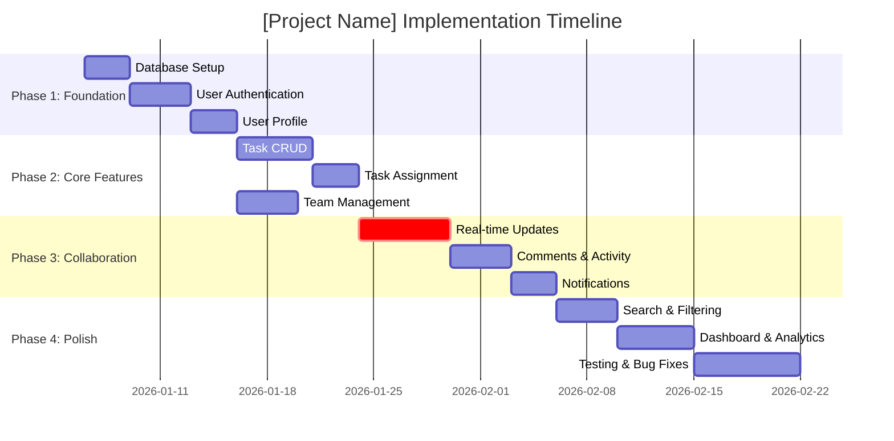

# Gantt Chart Generation - CodePilot v2.0

**Tier**: Core+
**Phase**: 2 (Planning)
**Feature #**: 3

## Purpose

Create visual timeline with task dependencies, milestones, and resource allocation to communicate project schedule clearly.

## When to Use

After creating implementation-plan.md with task breakdown, use this feature to generate a Gantt chart showing timeline and dependencies.

## Workflow

1. Review implementation-plan.md or tasks/INDEX.md
2. Identify all tasks with duration estimates
3. Map task dependencies (blocking, parallel)
4. Assign milestones
5. Generate Mermaid diagram
6. Analyze critical path

## Configuration Check

```javascript
config = read(".codepilot.config.json");
if (config.feature_tier >= "core_plus") {
  create_gantt_chart();
} else {
  skip_this_feature();
}
```

## Create Artifact

**File**: `docs/artifacts/phase2-planning/gantt-chart.md`

**Template**: `docs/templates/phase2/gantt-chart.md`

## Format

```markdown
# Implementation Timeline (Gantt Chart)

**Project**: [Project Name]
**Duration**: [Total weeks]
**Team**: [Team size]

## Visual Timeline



## Timeline Summary

**Total Duration**: [51 days (8 weeks with buffer)]
**Critical Path**: [task001 → task002 → task003 → task004 → task005 → task007]
**Critical Path Duration**: [23 days]
**Parallel Opportunities**: [task006 can run parallel with task004-005]

## Milestones

| Milestone | Week | Deliverables | Gate |
|-----------|------|--------------|------|
| M1 | 2 | Authentication complete, users can log in | Deploy to staging |
| M2 | 4 | Core task management working, CRUD functional | Security review |
| M3 | 6 | Real-time collaboration live, updates <100ms | Performance test |
| M4 | 8 | Production ready, all tests passing | Release approval |

## Dependencies

### Blocking Dependencies (Critical Path)
- task002 BLOCKS task003, task004 (authentication required)
- task005 BLOCKS task007 (assignment needed for real-time)
- task006 BLOCKS task008 (team context needed for comments)

### Optional Dependencies
- task006 can run parallel with task004-005 (independent team feature)
- task008-009 sequential but not on critical path

### External Dependencies
- [If any]: Third-party services, vendor deliverables, approvals

## Resource Allocation

| Week | Phase | Team | Notes |
|------|-------|------|-------|
| 1-2 | Foundation | All 3 devs | Sequential foundation work |
| 3-4 | Core | 2 devs (tasks) + 1 (teams) | Parallelized development |
| 5-6 | Collaboration | 2 devs (real-time) + 1 (polish) | Parallel workstreams |
| 7-8 | Testing | All 3 devs | Concentrated testing effort |

## Risk Analysis

### Critical Path Risks
- **Risk 1**: [If database setup delayed...]
  - **Impact**: 3-day slip on all downstream work
  - **Probability**: Low (schema finalized)
  - **Mitigation**: Pre-stage database scripts, have backup DDL ready

- **Risk 2**: [If real-time implementation complex...]
  - **Impact**: 6-day slip on collaboration features
  - **Probability**: Medium (WebSockets can be tricky)
  - **Mitigation**: Spike WebSockets early, have polling fallback

### Slack Analysis
- Task 006 (Team Management): 3 days slack before blocking task 008
- Task 008-009: 2+ weeks slack (non-critical)
- Task 010-011: 1+ week slack for bug fixes

**Critical Slack**: 0 days (no margin for error on critical path)

## Buffer Strategy

**Built-in Buffers**:
- 5% time buffer in each task estimate
- 2-day buffer before production release (testing)

**Risk Reserves**:
- 3 days for critical path (1 day per major phase)
- 5 days for integration testing

## Schedule Adjustments

**If Scope Expands**:
- Task 010-011 have 2+ weeks slack (absorb 10 days work)
- Task 012 is 7 days but can compress to 4 days (add resource)

**If Team Shrinks**:
- Remove task006 parallelization (add 4 days to critical path)
- Keep critical path (database → auth → tasks → real-time)

**If Major Issue Found**:
- Escalate immediately; 0-day slack means no recovery

## Success Criteria

- [ ] All tasks complete by planned date
- [ ] No critical path compression needed
- [ ] Milestones achieved on schedule
- [ ] Real deliverables match timeline (not just dates)
```

## Benefits

- **Visual Clarity**: Stakeholders see complete timeline at a glance
- **Dependency Visualization**: Understand what blocks what
- **Resource Planning**: Know when team members are needed
- **Risk Identification**: Critical path shows where problems hurt most
- **Communication**: Easy to discuss schedule with non-technical stakeholders

## Best Practices

1. **Be Realistic**: Estimates should include meetings, documentation, learning
2. **Include Buffers**: Add 10-20% contingency time
3. **Identify Critical Path**: Know what can't slip
4. **Plan Milestones**: Major checkpoints for stakeholder visibility
5. **Update Weekly**: Keep chart current during execution

## Token Cost

**Creation**: ~500 tokens
**Update**: ~200 tokens per update

## Related Features

- [Individual Task Files](individual-task-files.md) - Detailed task breakdown
- [Rollback Plan](rollback-plan.md) - Plan for timeline emergencies
- [Design Principles Checklist](design-principles-checklist.md) - Validate architecture supports timeline

## Integration with Planning Phase

This step occurs **after Step 5 (Develop Implementation Plan)**:

```
Step 4: Create Technical Design
  ↓
Step 4.5: Create Individual Task Files
  ↓
Step 5: Develop Implementation Plan
  ↓
Step 5.5: Generate Gantt Chart (THIS FEATURE)
  ↓
Step 6: Validate Design Principles
```

## Mermaid Syntax Quick Reference

```
gantt
    title Title
    dateFormat YYYY-MM-DD

    section Section Name
    Task Name           :taskid, start_date, duration
    Task with Deps      :taskid2, after taskid, duration
    Critical Task       :crit, taskid3, date, duration
    Milestone          :milestone, taskid4, date, 0d
```

**Duration**: `3d` (3 days), `1w` (1 week), `after taskid` (after previous task)
