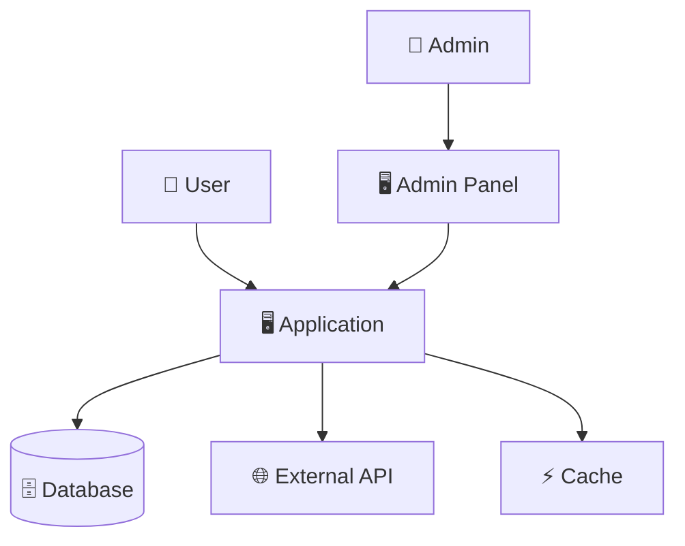
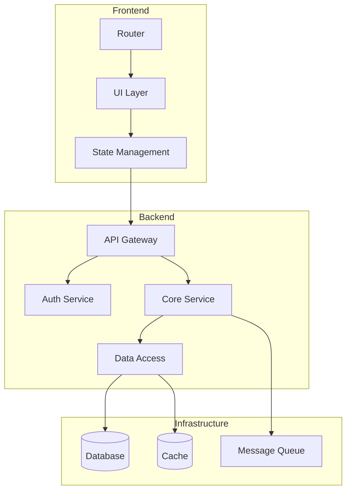
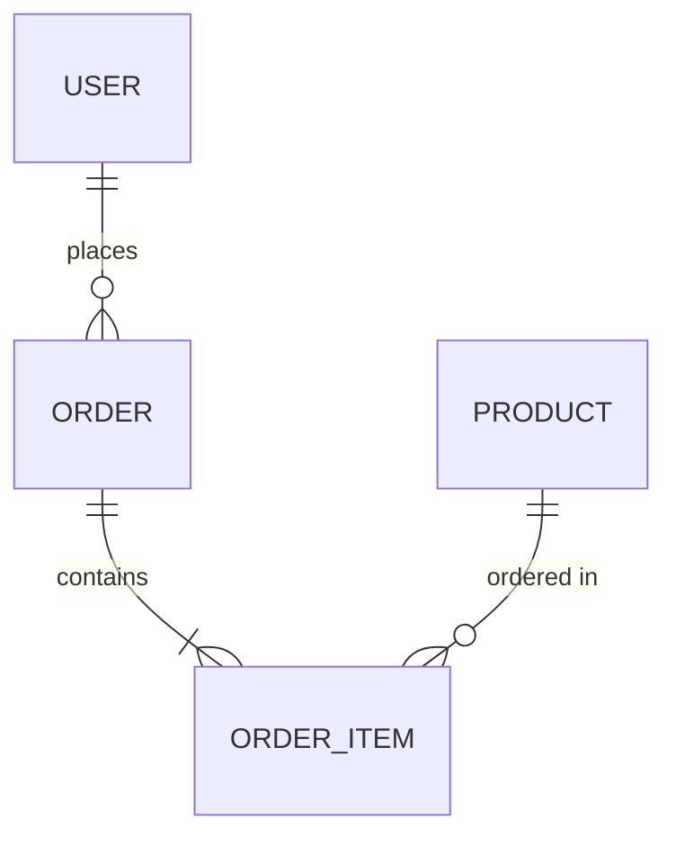
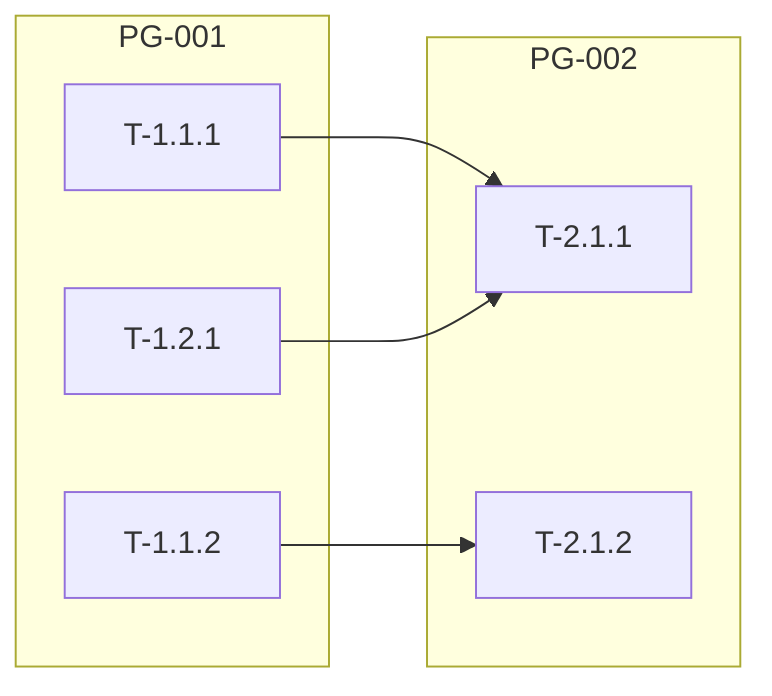

# Phase 2: Output Templates

> **Usage**: Load only when generating artifacts. Reduces context overhead.

---

## Blueprint Template

**File**: `./docs/architecture/blueprint-v[X.Y].md`

```markdown
# Engineering Blueprint

## Meta
| Field | Value |
|-------|-------|
| Version | [X.Y] |
| Created | [Date] |
| Specification | locked-specification-v[X.Y] |
| Author Role | Software Architect |
| Consulting Roles | Security Engineer, DevOps Engineer, Tech Lead |

## Change Log
| Version | Date | Changes |
|---------|------|---------|
| 1.0 | [Date] | Initial blueprint |

---

## Architecture Overview

[High-level description of the system architecture. 2-3 paragraphs covering:
- Overall pattern (monolith, microservices, serverless, etc.)
- Key design principles applied
- Main data flows]

---

## System Context Diagram



---

## Component Diagram



---

## Component Descriptions

### [Component Name]
| Field | Value |
|-------|-------|
| Responsibility | [Single responsibility description] |
| Technology | [Technology choice] |
| Dependencies | [What it depends on] |
| Dependents | [What depends on it] |

**Interfaces**:
- `[Interface 1]`: [Description]
- `[Interface 2]`: [Description]

**Key Design Decisions**:
- [Decision 1]
- [Decision 2]

---

### [Component Name 2]
[Repeat structure]

---

## Architectural Decisions

### AD-001: [Decision Title]
| Field | Value |
|-------|-------|
| Status | Accepted |
| Date | [Date] |
| Deciders | Software Architect, [Others] |

**Context**:
[Why this decision was needed]

**Options Considered**:
| Option | Pros | Cons |
|--------|------|------|
| [Option A] | [Pros] | [Cons] |
| [Option B] | [Pros] | [Cons] |

**Decision**:
[What was decided]

**Rationale**:
[Why this option was chosen]

**Consequences**:
- [Consequence 1]
- [Consequence 2]

---

### AD-002: [Decision Title]
[Repeat structure]

---

## Data Architecture

### Data Model Overview


### Primary Data Stores
| Store | Technology | Purpose | Data |
|-------|------------|---------|------|
| [Store 1] | [Tech] | [Purpose] | [What's stored] |

### Data Flow
[Description of how data flows through the system]

---

## Security Architecture

### Authentication
| Aspect | Approach |
|--------|----------|
| Method | [JWT/Session/OAuth/etc.] |
| Provider | [Internal/External] |
| MFA | [Yes/No] |

### Authorization
| Aspect | Approach |
|--------|----------|
| Model | [RBAC/ABAC/etc.] |
| Enforcement | [Where enforced] |
| Roles | [List roles] |

### Data Protection
| Data Type | Protection | At Rest | In Transit |
|-----------|------------|---------|------------|
| [Type] | [Method] | [Encryption] | [TLS] |

### Security Controls
- [Control 1]
- [Control 2]

---

## Scalability Design

### Scaling Strategy
| Component | Strategy | Trigger |
|-----------|----------|---------|
| [Component] | Horizontal/Vertical | [Metric threshold] |

### Bottleneck Analysis
| Potential Bottleneck | Mitigation |
|---------------------|------------|
| [Bottleneck] | [Solution] |

---

## Integration Points

| System | Protocol | Purpose | Auth | Rate Limit |
|--------|----------|---------|------|------------|
| [System] | REST/gRPC/etc. | [Purpose] | [Method] | [Limit] |

---

## Cross-Cutting Concerns

### Logging
[Logging strategy]

### Monitoring
[Monitoring approach - see monitoring-plan.md]

### Error Handling
[Error handling patterns]

### Caching
[Caching strategy]
```

---

## Technology Stack Template

**File**: `./docs/architecture/technology-stack.md`

```markdown
# Technology Stack

## Meta
| Field | Value |
|-------|-------|
| Created | [Date] |
| Blueprint | blueprint-v1.0 |
| Lock Files | [List lock files] |

---

## Core Stack

| Category | Technology | Version | Rationale | Lock File |
|----------|------------|---------|-----------|-----------|
| Language | [Lang] | [X.Y.Z] | [Why] | — |
| Runtime | [Runtime] | [X.Y.Z] | [Why] | — |
| Framework | [Framework] | [X.Y.Z] | [Why] | [File] |
| Database | [DB] | [X.Y.Z] | [Why] | — |
| Cache | [Cache] | [X.Y.Z] | [Why] | — |
| Queue | [Queue] | [X.Y.Z] | [Why] | — |

---

## Frontend Stack (if applicable)

| Category | Technology | Version | Rationale |
|----------|------------|---------|-----------|
| Framework | [React/Vue/etc.] | [X.Y.Z] | [Why] |
| State | [Redux/Zustand/etc.] | [X.Y.Z] | [Why] |
| Styling | [Tailwind/etc.] | [X.Y.Z] | [Why] |
| Build | [Vite/Webpack/etc.] | [X.Y.Z] | [Why] |

---

## Development Tools

| Category | Tool | Version | Purpose |
|----------|------|---------|---------|
| Package Manager | [npm/yarn/pip/etc.] | [X.Y.Z] | Dependency management |
| Linter | [ESLint/Pylint/etc.] | [X.Y.Z] | Code quality |
| Formatter | [Prettier/Black/etc.] | [X.Y.Z] | Code formatting |
| Test Runner | [Jest/Pytest/etc.] | [X.Y.Z] | Test execution |
| Coverage | [Istanbul/Coverage.py] | [X.Y.Z] | Coverage reporting |
| SAST | [Semgrep/Bandit/etc.] | [X.Y.Z] | Security scanning |

---

## Key Dependencies

| Dependency | Version | License | Purpose | Security Review |
|------------|---------|---------|---------|-----------------|
| [Dep 1] | [X.Y.Z] | [License] | [Purpose] | ✅ Reviewed |
| [Dep 2] | [X.Y.Z] | [License] | [Purpose] | ✅ Reviewed |

---

## Environment Requirements

### Development
```
OS: [macOS/Linux/Windows]
Runtime: [Node 20+, Python 3.11+, etc.]
Memory: [Minimum RAM]
Storage: [Minimum disk]
```

### Production
```
Platform: [Cloud provider/Self-hosted]
Compute: [Instance types/containers]
Scaling: [Auto-scaling config]
Regions: [Geographic regions]
```

---

## Lock File Management

### Generation
```bash
# Generate lock files
[package-manager] install

# Files generated:
# - package-lock.json
# - yarn.lock
# - poetry.lock
# - Cargo.lock
# etc.
```

### Update Policy
- Patch updates: Auto-merge with passing CI
- Minor updates: Review changelog, run full test suite
- Major updates: Dedicated upgrade task, migration plan

### Security Updates
- Critical: Immediate update
- High: Within 7 days
- Medium: Within 30 days
- Low: Next regular update cycle
```

---

## API Contracts Template

**File**: `./docs/architecture/api-contracts/openapi.yaml`

```yaml
openapi: 3.0.3
info:
  title: [Project Name] API
  description: |
    API specification for [Project Name].
    
    Generated during Phase 2: Planning.
    Blueprint: blueprint-v1.0
  version: 1.0.0
  contact:
    name: [Team Name]
    
servers:
  - url: http://localhost:3000/api
    description: Development
  - url: https://api.example.com
    description: Production

security:
  - bearerAuth: []

tags:
  - name: [Resource 1]
    description: [Description]
  - name: [Resource 2]
    description: [Description]

paths:
  /[resource]:
    get:
      tags:
        - [Resource]
      summary: List [resources]
      operationId: list[Resources]
      parameters:
        - name: page
          in: query
          schema:
            type: integer
            default: 1
        - name: limit
          in: query
          schema:
            type: integer
            default: 20
            maximum: 100
      responses:
        '200':
          description: Success
          content:
            application/json:
              schema:
                $ref: '#/components/schemas/[Resource]List'
        '401':
          $ref: '#/components/responses/Unauthorized'
        '500':
          $ref: '#/components/responses/InternalError'
          
    post:
      tags:
        - [Resource]
      summary: Create [resource]
      operationId: create[Resource]
      requestBody:
        required: true
        content:
          application/json:
            schema:
              $ref: '#/components/schemas/Create[Resource]Request'
      responses:
        '201':
          description: Created
          content:
            application/json:
              schema:
                $ref: '#/components/schemas/[Resource]'
        '400':
          $ref: '#/components/responses/BadRequest'
        '401':
          $ref: '#/components/responses/Unauthorized'

  /[resource]/{id}:
    get:
      tags:
        - [Resource]
      summary: Get [resource] by ID
      operationId: get[Resource]
      parameters:
        - name: id
          in: path
          required: true
          schema:
            type: string
            format: uuid
      responses:
        '200':
          description: Success
          content:
            application/json:
              schema:
                $ref: '#/components/schemas/[Resource]'
        '404':
          $ref: '#/components/responses/NotFound'

components:
  securitySchemes:
    bearerAuth:
      type: http
      scheme: bearer
      bearerFormat: JWT
      
  schemas:
    [Resource]:
      type: object
      required:
        - id
        - name
      properties:
        id:
          type: string
          format: uuid
        name:
          type: string
          maxLength: 255
        createdAt:
          type: string
          format: date-time
        updatedAt:
          type: string
          format: date-time
          
    [Resource]List:
      type: object
      properties:
        items:
          type: array
          items:
            $ref: '#/components/schemas/[Resource]'
        total:
          type: integer
        page:
          type: integer
        limit:
          type: integer
          
    Create[Resource]Request:
      type: object
      required:
        - name
      properties:
        name:
          type: string
          maxLength: 255
          
    Error:
      type: object
      required:
        - code
        - message
      properties:
        code:
          type: string
        message:
          type: string
        details:
          type: object
          
  responses:
    BadRequest:
      description: Bad Request
      content:
        application/json:
          schema:
            $ref: '#/components/schemas/Error'
    Unauthorized:
      description: Unauthorized
      content:
        application/json:
          schema:
            $ref: '#/components/schemas/Error'
    NotFound:
      description: Not Found
      content:
        application/json:
          schema:
            $ref: '#/components/schemas/Error'
    InternalError:
      description: Internal Server Error
      content:
        application/json:
          schema:
            $ref: '#/components/schemas/Error'
```

---

## Task Template

**File**: `./docs/architecture/tasks/[M]/[MOD]/T-X.X.X.md`

```markdown
# T-[X.X.X]: [Task Name]

## Meta
| Field | Value |
|-------|-------|
| Status | ⏳ Pending |
| Milestone | M[X]: [Name] |
| Module | M[X]-MOD[Y]: [Name] |
| Created | [Date] |
| Started | — |
| Completed | — |
| Assignee | [Name or Unassigned] |

---

## Objective
[Clear, concise statement of what this task accomplishes]

---

## Acceptance Criteria Mapping

| AC ID | Criterion | Verification |
|-------|-----------|--------------|
| AC-XXX | [Criterion text] | [Test/Review] |

---

## Dependencies

### Requires (must complete first)
| Task | Status | Reason |
|------|--------|--------|
| T-X.X.X | ⏳ | [Why needed] |

### Blocks (waiting on this)
| Task | Reason |
|------|--------|
| T-X.X.X | [Why blocked] |

---

## Parallelization

| Field | Value |
|-------|-------|
| Parallel Group | PG-XXX |
| Can Run With | T-X.X.X, T-X.X.X |
| Sequential After | T-X.X.X |
| Blocks | T-X.X.X |

---

## Effort Tracking

| Type | Value |
|------|-------|
| Estimated | [X] hours |
| Actual | — |
| Variance | — |
| Variance % | — |

### Estimation Rationale
- Complexity: [Low/Medium/High]
- Risk factors: [List]
- Similar past tasks: [Reference if any]

### Time Log
| Date | Duration | Notes |
|------|----------|-------|
| | | |

---

## Technical Notes

### Approach
[How this should be implemented]

### Key Decisions
[Any decisions to make during implementation]

### Files to Create/Modify
- [ ] `src/path/to/file.ts` - [Purpose]
- [ ] `tests/path/to/test.ts` - [Tests]

### API Contracts
[Reference to relevant API contract sections]

---

## Implementation Log

<!-- Populated during Phase 3 -->

### [Date] - Implementation Started
**Files Modified**:
- [File list]

**Decisions Made**:
- [Decision]

**Notes**:
- [Notes]

---

## Verification

### Tests Required
- [ ] Unit tests for [component]
- [ ] Integration test for [flow]

### Manual Verification
- [ ] [Verification step]

---

## Rollback Plan
[How to undo this task's changes if needed]

```bash
# Revert commit
git revert [commit-sha]
```
```

---

## Parallel Groups Template

**File**: `./docs/architecture/tasks/_parallel-groups.md`

```markdown
# Parallel Task Groups

## Overview

Parallel groups identify tasks that can execute concurrently, enabling faster implementation when resources allow.

## Execution Strategy

- **Solo Mode**: Execute parallel tasks sequentially within groups
- **Team Mode**: Assign parallel tasks to different team members
- **CI Mode**: Run parallel task tests concurrently in pipeline

---

## Group Definitions

### PG-001: [Group Name]

**Description**: [What these tasks do together]

| Task | Description | Dependencies | Status |
|------|-------------|--------------|--------|
| T-1.1.1 | [Desc] | None | ⏳ |
| T-1.1.2 | [Desc] | None | ⏳ |
| T-1.2.1 | [Desc] | None | ⏳ |

**Completion Criteria**: All tasks ✅ before proceeding to dependent tasks.

**Blocked Tasks**: T-2.1.1, T-2.1.2

---

### PG-002: [Group Name]

[Repeat structure]

---

## Dependency Graph



---

## Branch Strategy for Parallel Execution

```bash
# Create parallel group branch
git checkout develop
git checkout -b parallel/PG-001

# After all tasks in group complete
git checkout develop
git merge parallel/PG-001 -m "Merge parallel group PG-001

Tasks completed:
- T-1.1.1: [Name]
- T-1.1.2: [Name]
- T-1.2.1: [Name]"
```
```
